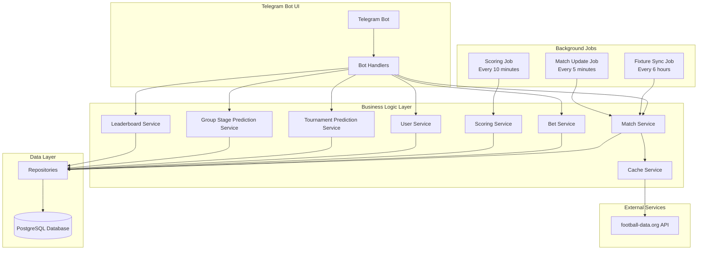

# Architecture

## System Overview

## Key Components

### Telegram Bot Layer
- User interface with inline keyboards and buttons
- Command handlers for user interactions
- Conversation flows for placing bets and predictions

### Service Layer
Business logic for:
- Match management and synchronization
- Bet placement and validation
- Scoring calculations
- User management
- Tournament and group stage predictions
- Leaderboard generation
- API response caching

### Data Layer
- PostgreSQL database with repositories pattern
- Materialized views for optimized leaderboard queries
- Foreign key constraints for data integrity

### External API Integration
- football-data.org API client with rate limiting
- Built-in TTL cache to protect against API rate limits (10 calls/minute)
- Automatic retry logic with exponential backoff

### Background Jobs

| Job | Schedule | Purpose |
|-----|----------|---------|
| Fixture Sync | Every 6 hours | Syncs matches and groups from football-data.org |
| Match Updates | Every 5 minutes | Updates live match scores and statuses |
| Scoring | Every 10 minutes | Calculates points for finished matches |

## Data Flow

1. **User Interaction**: User sends command to Telegram bot
2. **Handler Processing**: Bot handler validates input and calls appropriate service
3. **Service Logic**: Service implements business rules and calls repositories
4. **Data Persistence**: Repository executes SQL queries against PostgreSQL
5. **Response**: Results flow back through the layers to the user

## External API Usage

- **Rate Limiting**: 10 calls per minute (free tier)
- **Caching**: In-memory TTL cache reduces API calls
- **Data Fetched**: Fixtures, live scores, group standings, team information
- **Configurable Leagues**: Supports multiple leagues via DEFAULT_LEAGUE_IDS
